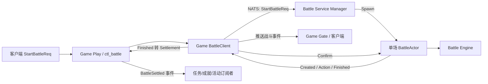

# 后端战斗代码说明

本文根据当前仓库实现梳理 `gogs` 后端战斗链路，重点说明请求如何进入战斗服务、引擎如何推进战斗、战报如何返回，以及目前实现边界。战斗协议源文件位于 `protocol/cspb/battle`，Go 生成类型位于 `gogs/pb/cspb/pb_battle`。

## 1. 总体结构

战斗分为 Game 接入层、独立 Battle 服务、单场战斗 Actor、确定性模拟引擎四部分：

关键边界：Game 负责身份与单角色成长数据组装、节点选择、通知转发和业务结算入口；Battle 服务负责生成战斗 ID 与随机种子、运行模拟、保存战报和发结果通知；Engine 不直接访问网络、Actor 框架或数据库。

## 2. 主要目录和职责

| 位置 | 职责 |
| --- | --- |
| `gogs/game/play/internal/ctl/ctl_battle/battle.go` | 注册的战斗业务处理：接收开始战斗请求、组装服务端权威请求、收到结果后触发结算 |
| `gogs/game/battle/client.go` | Game 进程内的 BattleClient Actor：选择 Battle 节点，管理玩家战斗状态，去重事件并转发通知 |
| `gogs/game/battle/settlement.go` | 结算输入模型 `Settlement` 与参与者信息 |
| `gogs/battle/service/internal` | Battle Manager：接收开始请求，生成 ID/seed，创建并回收单场 Actor |
| `gogs/battle/battle/internal/actor.go` | 单场战斗生命周期：创建通知、按 tick 推进、发事件、战报保存、Finished 和确认处理 |
| `gogs/battle/battle/internal/factory.go` | 校验请求并将请求、`glconf` 配置转换为 Engine 的运行时单位和规则 |
| `gogs/battle/battle/internal/engine` | 纯战斗模拟：时间线、目标选择、伤害计算、事件序列、结果校验和 checksum |
| `gogs/glconf/conf_battle*.go` | 战斗规则、角色、怪物、怪物组、技能、状态、装备配置读取器 |
| `gogs/pb/cspb/pb_battle` | 战斗请求、通知、事件、结果等 Protobuf 生成类型 |

## 3. 一场战斗的调用过程

### 3.1 Game 收到开始请求

`ctl_battle.OnCreateBattle` 从在线玩家上下文取 UID，调用 `buildBattleRequest` 后向 `def.BattleClient` 发起 `Begin`。Game 从玩家的角色、装备及后续修炼模块读取权威数据并组装请求；客户端不能指定战斗属性、技能或装备。请求通过 `core.RegisterPlayerMsg` 路由进入时，会要求 UID 非零且玩家在线。

当前 Game 战斗入口固定为塔模式：

- 战斗类型：`BATTLE_TYPE_TOWER`。
- 攻击方：玩家唯一角色模块中的角色快照；请求内传来的属性、技能和装备值不直接使用。
- 防守方角色：清空，由怪物组配置提供敌人。
- 怪物组配置 ID：玩家当前 `TowerMgr.Layer`。
- 当前默认角色来自 `PlayerInitRoleCfg`，每个玩家只创建一个；装备和技能养成从对应玩家模块组装。

Tower 层数从玩家服务端数据读取；MonsterGroupConfigId 仍以塔层数为约定。角色属性和装备数值由 Battle 配置编译器计算。

### 3.2 Game BattleClient 选节点并发起战斗

`game/battle.Client` 是 Actor，内部按 UID 保存状态：`Idle → Creating → CreateUnknown → Running → Finished`。开始时通过 `ClusterSelector` 从服务注册表读取 `def.ServiceBattle` 实例并轮询选择一个节点，再通过 NATS 向该节点的 `def.BattleService` 投递 `StartBattleReq`。

发送成功后状态置为 `CreateUnknown`，等 Battle 服务返回 `BattleCreatedNtf` 才记为 `Running`。这是为了区分“请求已经发出、回执还没到”的不确定窗口，避免盲目重发导致重复创建战斗。当前状态与完成记录都保存在内存 Map 中。

### 3.3 Battle Manager 创建单场 Actor

`battle/service/internal.Server.OnCreateBattle` 检查 UID、来源 Server/Node 和战斗类型，生成 UUID 形式的 BattleID 以及 64 位随机 seed，然后 `SpawnOne` 创建 `BattleActor`。Manager 的 `active` Map 记录 BattleID 到 Actor PID 的关系，Actor 停止时由 `ActorStopped` 清理。

Manager 默认使用 `MemoryRepository` 保存战报；它负责 Actor 生命周期管理，不持有战斗过程状态或玩家存档。

### 3.4 BattleActor 运行并回传通知

Actor 初始化后按运行模式创建 Engine。当前生产创建路径为 `ModeRun`：

1. 从请求和战斗配置构建 Engine。
2. 发送 `BattleCreatedNtf`，包含 BattleID、UID、tick 时长和初始单位快照。
3. 依据 `TickDurationMS` 使用时间轮按节拍调用 `Advance`，把当前 tick 新产生的事件逐条作为 `BattleActionNtf` 同步通知 Game。
4. 战斗结束后生成完整结果和 `BattleEnded` 事件。
5. 先保存 `Report`，再发送 `BattleFinishedNtf`。该顺序确保 Finished 的 checksum 对应已完成的整份结果。
6. 收到 `BattleResultConfirmedNtf` 后确认战报并退出，由 Manager 清理 active 记录。

Battle 通知由 `Notifier` 抽象，线上实现通过 NATS 投递回来源 Game 节点。Actor 名称由 BattleID 派生，因此确认通知可路由回对应单场 Actor。

### 3.5 Game 接收事件与结算

BattleClient 会检查 UID、BattleID 和状态是否匹配；Action 事件要求 Sequence 非零，并按 Sequence 去重，然后通过 Game Gate 推送给玩家。Finished 即便先于 Created 到达也能建立结束态；重复 Finished 不会重复推客户端或再次投递结算，但仍会尝试向 Battle Actor 发送确认。

首次收到 Finished 后，BattleClient 构造 `Settlement` 并发给 Play Actor。Play 的 `OnBattleFinished` 当前会记录日志并广播 `core.BattleSettled`，供任务、成就、活动等订阅者处理。该函数明确尚未实现玩家数据 load/modify/save，也没有业务奖励或爬塔进度落库逻辑。离线玩家不会因不在线而跳过结算入口。

## 4. 战斗输入和配置映射

`ConfigCompiler` 负责将请求转成完整的 `engine.Setup`。`BattleConfigSource` 隔离配置读取，`BattleMode` 按模式校验阵容并构建对手，`RoleStatCalculator` 和 `RoleSkillProgression` 为角色养成数值提供扩展点。所有配置在创建时解析，Engine 运行中只读内存快照。主要配置表如下：

| 配置 | 字段和用途 |
| --- | --- |
| `BattleRuleCfg` | 行动阈值、最大行动次数、伤害浮动、暴击率/倍率、每 tick 毫秒数 |
| `BattleRoleCfg` | 角色基础 HP/攻击/防御/速度、默认站位、普攻/主动技能/初始状态 |
| `BattleMonsterCfg` | 怪物基础属性、普攻/主动技能/初始状态 |
| `BattleMonsterGroupCfg` | 怪物配置 ID 与站位列表；成员用 `TypIDVal` 表示，类型为 `battle_monster`、ID 为怪物配置 ID、Val 为站位 |
| `BattleSkillCfg` | 冷却、目标规则、效果、前摇 tick、后摇 tick |
| `BattleStatusCfg` | 状态类型、持续行动数、DOT/HOT 强度和属性修正数据 |
| `BattleEquipCfg` | 装备的属性修正列表；默认角色计算器把静态修正累加到角色基础属性 |

角色请求若带 Skills，则以请求中的技能配置 ID 列表为准；否则使用角色配置中的主动技能。装备修正目前只加 MaxHP、Attack、Defense、Speed。技能效果类型目前识别 `battle_damage`、`battle_heal`、`battle_status`；目标规则由协议枚举值映射。

请求类型限制：

- 塔、Boss、剧情、测试：攻击方角色至少一个；不允许传防守方角色；必须传怪物组 ID。
- PVP：攻击方和防守方必须各一个角色；不能传怪物组 ID。
- 其他战斗类型会被拒绝。

工厂还会检查缺失配置、空成员、重复位置等错误；Engine 再校验至少两名单位、双方阵营均存在、单位 ID 唯一、HP/速度为正、普攻存在等基础约束。

## 5. Engine 的执行模型

Engine 是确定性、tick 驱动的模拟器。Battle Manager 给定 BattleID 和 seed；Engine 使用 seed 初始化 RNG。`Run` 是一次性跑完整场的便捷接口，Actor 的线上执行则循环使用 `NextTick`、`Advance` 和 `Flush`，逐 tick 生成同一条事件序列。

### 时间线和行动

- 单位初始行动间隔按 `ceil(ATBThreshold / speed)` 计算，最小为 1 tick。
- 时间线按 tick、phase、action ID、单位站位/实例 ID 排序，保证同一 tick 的处理次序稳定。
- 每个行动有 Start、Impact、End 三个阶段。`SKILL_USED` 事件带 `StartTick / ImpactTick / EndTick`，客户端可据此启动前摇、命中和后摇表现。
- 不同单位行动可重叠；同一单位下一次行动不会早于前一次 End。
- 单体敌人目标按站位再按实例 ID 选择；全体敌人按同样顺序；最低血量友方按血量比例选取，平手时再按站位和实例 ID。
- 控制状态处理中包含眩晕跳过行动、沉默时回退到普攻。DOT/HOT 在行动开始时结算，状态持续时间在行动结束时减少。

### 伤害和结果

伤害流水线顺序为：基础攻击减防（至少 1）→ 千分比系数与固定值 → 伤害浮动 → 暴击判定及倍率 → 最小伤害保护。治疗量按攻击系数与固定值计算，并受目标 MaxHP 上限限制。

事件包含全局递增 Sequence、Action、Tick、事件类型、行动者/目标/技能/状态 ID、数值和 HP 前后值等信息。最终结果包含 BattleID、类型、胜负、tick、单位终态、完整事件流和 SHA-256 checksum。checksum 对确定的结果字段做 JSON 编码后计算，因此相同输入和 seed 应产生相同结果。

## 6. 当前实现边界和阅读时需注意的事项

1. **玩家持久层仍待接入。** Game 从角色、装备等玩家模块组装服务端快照；新玩家角色由 `PlayerInitRoleCfg` 初始化为单个角色。当前玩家加载/保存仍为空实现，持久层接入时要保持各模块独立存储。
2. **成长公式尚未配置。** 当前默认角色计算器使用角色基础属性和装备静态修正；等级、境界及其他修炼模块的加成需要由 Game 汇总到权威战斗快照，再由 `RoleStatCalculator` 统一计算，技能成长则由 `RoleSkillProgression` 扩展。
3. **游戏结算没有落地。** `OnBattleFinished` 只日志并广播 `BattleSettled`；玩家奖励、进度和存档尚未实现。接入持久层时需按 BattleID 幂等处理，处理 Finished 重复投递。
4. **战报仓储不是持久化存储。** Battle Service 当前用 `MemoryRepository`，进程重启会丢失战报和确认信息。
5. **Finished 重试尚未真正启用。** Actor 的 `scheduleRetry` 中重试 timer 逻辑被注释；虽然有 retry 计数和配置字段，但当前代码不会按配置自动重试 Finished。
6. **BattleClient 状态是进程内状态。** 玩家战斗态、Sequence 去重集合和 completed BattleID 均为内存 Map，重启后不保留。
7. **战报重投模式有接口但当前创建入口未见接入。** `ModeRedeliver` 可读取已有 Report 并回放 Created/Action/Finished，但 Service 创建入口始终传 `ModeRun`；当前 MemoryRepository 也无法支撑重启恢复。
8. **状态效果实现不完整。** Engine 支持初始状态中的 Stun、Silence、DOT、HOT 处理；属性 Modifier 暂未参与属性计算。技能命中 `battle_status` 时当前只写出 `STATUS_APPLIED` 事件，detail 标记 `unsupported status config`，并没有把状态加入目标状态列表。

## 7. 建议阅读顺序

1. 从 `gogs/game/play/internal/ctl/ctl_battle/battle.go` 看 Game 请求入口与结算。
2. 看 `gogs/game/battle/client.go` 的节点选择、状态机、通知去重和回执。
3. 看 `gogs/battle/service/internal/ctl_battle.go` 与 `gogs/battle/battle/internal/actor.go` 的创建和生命周期。
4. 看 `gogs/battle/battle/internal/factory.go` 了解请求及配置如何变成运行时数据。
5. 最后看 `gogs/battle/battle/internal/engine/battle.go`、`timeline.go`、`damage.go`、`replay.go` 了解模拟规则。
