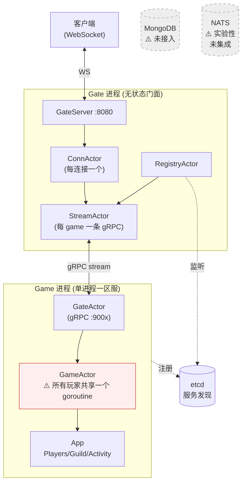
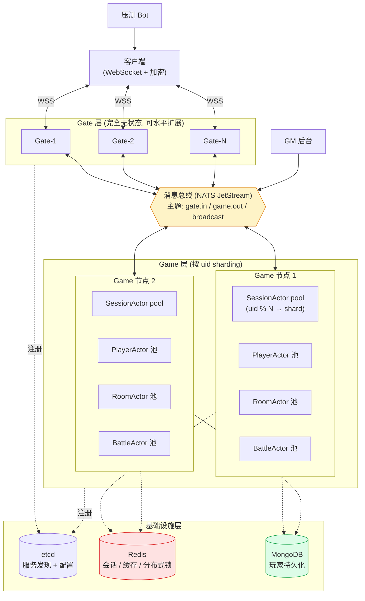
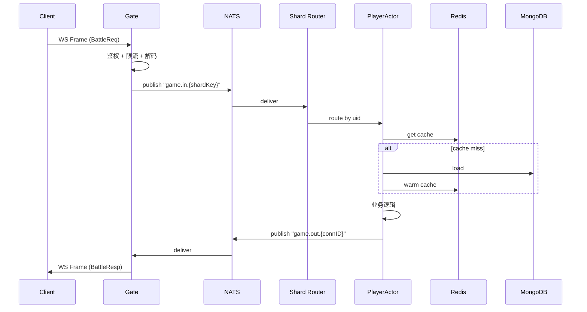
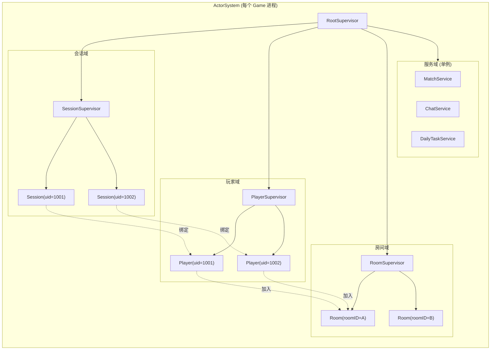

# 架构评审与未来规划

> 基于 2026-05-24 的代码快照。本文档关注**系统架构**层面，与 `OPTIMIZATION.md`（关注代码缺陷）互补。

## 目录

- [一、当前架构画像](#一当前架构画像)
- [二、架构层面的核心问题](#二架构层面的核心问题)
- [三、未来规划：目标架构](#三未来规划目标架构)
- [四、迁移路线图](#四迁移路线图)

---

## 一、当前架构画像

### 1.1 现有拓扑



### 1.2 当前架构的核心特征

| 特征 | 现状 |
|------|------|
| 并发粒度 | **单 GameActor 串行处理整个区服**所有玩家消息 |
| 玩家会话 | 不存在，仅有 ConnActor + uid 字段 |
| 进程间通信 | gRPC 双向流，Gate 主动连 Game |
| 流持有 | GateActor 只保存 1 条 stream，多 Gate 会覆盖 |
| 持久化 | 无，纯内存 |
| 消息总线 | 无 |
| 容错 | 无（无 supervisor、无重连、无重启策略） |

---

## 二、架构层面的核心问题

### 2.1 「serverID = 单 Game 进程」的耦合

**问题表现**：

- 客户端 `LoginReq.server_id` 直接选定一个 Game 进程
- 该 server 所有玩家消息都进同一个 `GameActor`（单 goroutine）
- Game 进程崩了 = 整个区服下线
- 加机器只能开新区服，不能分担现有区服压力

**这与 Actor 模型的本意相悖。** Actor 的扩展性来自"按 actor key 分片"，而不是把所有玩家挤进一个 actor。

**影响**：
- 容错：单点故障
- 性能：整服 CPU 上限 = 单核
- 扩展：横向扩容只能开新区

> `docs/actor-design.md` 列了 PlayerActor / RoomActor / BattleActor，但**实现里 GameActor 是个大锅**。设计文档与实现脱节。

---

### 2.2 Gate↔Game 的 gRPC 双向流方向问题

**当前**：Gate 主动连 Game。

**问题**：
- Gate 重启 / 崩溃，Game 不感知，in-flight 回包丢失
- 多 Gate × 多 Game = N×M stream 矩阵，但 `GateActor.stream` 只能存 1 条
- Gate 持有 stream 所有权，违反"Gate 无状态"原则

**三种可选方案**：

| 方案 | 优点 | 代价 |
|------|------|------|
| 保持现拓扑，Game 用 `map[gateID]stream` | 改动最小 | 仍是 N×M，Gate 重启 Game 无感知 |
| 反转：Game 主动连 Gate | Gate 完全无状态 | 需要 Gate 也注册到 etcd |
| 引入消息总线（NATS / Redis Streams） | 完全解耦，原生支持广播 / 跨服 | 多一跳延迟，多一个组件 |

`nats/` 目录已有半成品 → 推荐方案 3。跨服聊天、公会广播等需求迟早会来。

---

### 2.3 Frame 协议的根本缺陷

```protobuf
message Frame {
  uint64 uid       = 1;
  string server_id = 2;
  uint64 conn_id   = 4;
  bytes  payload   = 5;  // ← protobuf 套 protobuf
  string msg_type  = 6;  // ← 字符串当类型 ID
}
```

**三个问题**：

1. **双重序列化**：Gate marshal 一次塞进 payload，Game 再 unmarshal 一次
2. **类型 ID 用 FNV 截断到 uint16**：65536 槽位必然碰撞，且**碰撞静默错乱**
3. **缺少必备元数据**：没有 trace_id、seq、version、flags

**建议**：
- 用 `oneof` + 显式数字 tag 承载具体消息
- 现在就把 trace_id / seq / version 加上，事后补很难

---

### 2.4 没有"玩家会话"概念

**当前**：`ConnActor.uid` 是登录时设置的字段，没有独立的会话对象。

**带来的问题**：
- **断线重连**：新 ConnActor 是新 connID，Game 无法感知"还是那个玩家"
- **多端登录**：同一 uid 在两端登录无处理
- **跨服切换**：玩家从 server 1 跳到 server 2，状态迁移无机制

**建议**：引入 `SessionActor`，按 uid 唯一存在，是 Game 侧的玩家入口。connID 只是会话的"当前接入点"，会话生命周期独立于连接。

---

### 2.5 消息分层混乱

**Gate 应该独占的消息**：login / logout / heartbeat / kick / 选服 / 限流 / token 续期

**Game 应该独占的**：所有业务消息

**当前**：`GateRouter` 只处理 `LoginReq`，心跳、断线通知、踢人都缺失。Gate 沦为纯转发器。

---

### 2.6 Actor 框架（bigTree）的能力空缺

| 能力 | 是否有 | 影响 |
|------|--------|------|
| Supervisor / 重启策略 | ❓ 不明确 | actor panic 后系统行为未知 |
| Ask（请求-响应） | ❓ 不明确 | Reply 只能 fire-and-forget |
| 远程 actor（跨进程透明） | 无 | 所以才需要手写 GateActor + Frame |
| 死信队列 | ❓ | 发给不存在 actor 的消息处理未知 |
| 持久化 mailbox | 无 | 进程崩溃丢消息 |

PlayerActor / RoomActor 拆分推进前，这些基础能力需要先评估或补齐。

---

### 2.7 缺少游戏服务器标配组件

- **DB 持久化层**：玩家数据纯内存，进程重启全丢
- **缓存层**：MongoDB 直读直写扛不住高频操作
- **配置热加载**：策划改数值、开活动需不重启更新
- **GM / 后台**：踢人 / 发邮件 / 查玩家
- **压测 Bot 框架**：验证架构改动的工具
- **协议加密**：WebSocket 明文 + token 明文

---

### 2.8 目录组织按"代码角色"而非"业务领域"

**当前**：
```
game/
├── ctl/      # handlers（按角色）
├── router/   # 路由（按角色）
├── model/    # actors（按角色）
└── player/、guild/、activity/  # 业务模块（部分为空）
```

**问题**：业务一多，`ctl/` 和 `router/` 会膨胀成大文件，所有人改同一处冲突。

**建议**：按 domain 切，每个 domain 内自包含 actor + 消息 + handler。

---

## 三、未来规划：目标架构

### 3.1 目标拓扑



### 3.2 玩家消息流（Read 路径）



### 3.3 Actor 层级模型



**关键约束**：
- 每个玩家有且仅有一个 PlayerActor（按 uid 路由）
- Session 与 Player 1:1，但 Session 可换 connID（断线重连）
- Player 同一时刻只在一个 Room
- Room / Battle 这类有限生命周期 actor 由对应 Supervisor 管理

### 3.4 目标目录结构（domain-driven）

```
gogs/
├── cmd/
│   ├── gate/        # Gate 进程入口
│   └── game/        # Game 进程入口
├── domain/
│   ├── session/     # 会话：Actor + 消息 + handler
│   ├── player/      # 玩家
│   ├── battle/      # 战斗
│   ├── room/        # 房间
│   ├── guild/       # 公会
│   └── chat/        # 聊天
├── infra/
│   ├── persist/     # MongoDB 仓储层
│   ├── cache/       # Redis 封装
│   ├── bus/         # NATS 封装（统一发布/订阅 API）
│   ├── codec/       # 编解码
│   └── cluster/     # etcd 服务发现
├── protocol/        # proto 源
├── pb/              # 生成产物
├── runtime/         # actor system 装配 / 启动 / 优雅停机
└── tools/
    ├── gm/          # GM 后台
    └── bot/         # 压测 bot
```

每个 `domain/xxx/` 内部自包含：
```
domain/player/
├── actor.go         # PlayerActor 定义
├── messages.go      # 内部消息
├── handler.go       # 业务 handler
├── repository.go    # 持久化接口（实现在 infra/persist）
└── actor_test.go
```

---

## 四、迁移路线图

```mermaid
gantt
    title 架构演进路线（相对工作量）
    dateFormat  X
    axisFormat %s

    section P0 修复正确性
    OPTIMIZATION.md 第一批 严重 bug      :p0-1, 0, 5
    GateActor.stream 多流支持            :p0-2, after p0-1, 3
    StreamActor 重连                     :p0-3, after p0-2, 3
    优雅停机                             :p0-4, after p0-3, 2

    section P1 架构基础
    引入 SessionActor                    :p1-1, after p0-4, 5
    引入 PlayerActor (按 uid sharding)   :p1-2, after p1-1, 8
    持久化层 (MongoDB Repository)        :p1-3, after p1-2, 5
    缓存层 (Redis)                       :p1-4, after p1-3, 5
    Frame 协议重构 (oneof + 元数据)      :p1-5, after p0-4, 5

    section P2 解耦演进
    Gate 心跳 / 断线通知                 :p2-1, after p1-1, 3
    NATS 消息总线接入                    :p2-2, after p1-5, 8
    替换 gRPC 双向流                     :p2-3, after p2-2, 5
    bigTree 补齐 supervisor              :p2-4, after p1-2, 8

    section P3 工程基础
    metric / tracing                     :p3-1, after p1-2, 5
    GM 后台                              :p3-2, after p1-3, 8
    压测 Bot 框架                        :p3-3, after p3-1, 5
    domain-driven 目录重构               :p3-4, after p2-2, 5
    协议加密                             :p3-5, after p2-3, 3
```



### 4.1 P0：修复正确性（先让系统能跑）

详见 `OPTIMIZATION.md` 第一批。这一阶段不引入新架构，**只修明显 bug**：
- Codec 注册流程
- ConnActor 状态错误
- GateActor.stream 多流支持
- StreamActor 重连
- 优雅停机

**完成后状态**：单 Gate + 单 Game 能稳定跑通登录 + 业务消息 + 回包。

### 4.2 P1：架构基础（决定能否上线）

**步骤**：

1. **引入 SessionActor**
   - 每个 uid 一个 Session，Session 持有 connID 引用
   - 解决断线重连、多端登录

2. **引入 PlayerActor（按 uid sharding）**
   - GameActor 退化为"路由器"，只负责 dispatch
   - PlayerActor 池由 PlayerSupervisor 管理
   - 单服并发能力从 1 核 → N 核

3. **持久化层**
   - 定义 `PlayerRepository` 接口
   - MongoDB 实现，PlayerActor 启动时 load、定期 / 关键操作 save
   - 加 Redis 缓存层

4. **Frame 协议重构**
   - 用 oneof 替换 bytes payload
   - 加 trace_id / seq / version

**完成后状态**：单服可承载真实玩家压力，玩家数据不丢失。

### 4.3 P2：解耦演进（横向扩展能力）

1. **Gate 完整化**：心跳、踢人、断线通知 Game

2. **NATS 消息总线**：替代 gRPC 双向流
   - 主题设计：`game.in.{shardKey}` / `game.out.{connID}` / `broadcast.{scope}`
   - 跨服广播原生支持
   - Gate / Game 都通过 NATS 通信，不再点对点

3. **bigTree 补齐基础能力**：
   - Supervisor 重启策略
   - Ask 模式（请求-响应）
   - 死信队列

**完成后状态**：可水平扩展 Gate 和 Game，跨服功能（聊天、公会）有合理通道。

### 4.4 P3：工程基础（长期可维护性）

- metric（Prometheus）+ tracing（OpenTelemetry）
- GM 后台
- 压测 Bot 框架
- 目录重构为 domain-driven
- 协议加密 + token 续期

---

## 附：阶段性架构对比

| 维度 | 当前 | P1 完成 | P2 完成 |
|------|------|---------|---------|
| 单服并发粒度 | 1 个 actor | uid sharding | uid sharding |
| 单服故障爆炸半径 | 整服下线 | 整服下线 | 单 shard 下线（取决于 supervisor） |
| Gate 横向扩展 | 受限于 stream 单点 | 受限于 stream 单点 | 完全无状态 |
| Game 横向扩展 | 不支持 | shard 内并行 | shard 跨节点 |
| 跨服通信 | 不支持 | 不支持 | NATS 原生 |
| 数据持久化 | 无 | MongoDB + Redis | MongoDB + Redis |
| 协议演进 | 无版本 | 有 version 字段 | 有 version + 兼容层 |
| 可观测性 | 日志 | 日志 | 日志 + metric + trace |
| 容错 | 无 | Supervisor (P1 末) | 完整 |

---

## 相关文档

- [`OPTIMIZATION.md`](./OPTIMIZATION.md) — 代码层面的具体缺陷与修复建议
- [`ARCHITECTURE.md`](./ARCHITECTURE.md) — 当前架构说明
- [`actor-design.md`](./actor-design.md) — Actor 拆分原则
