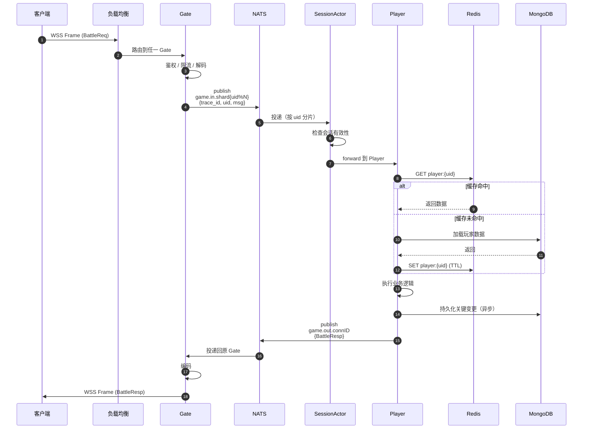
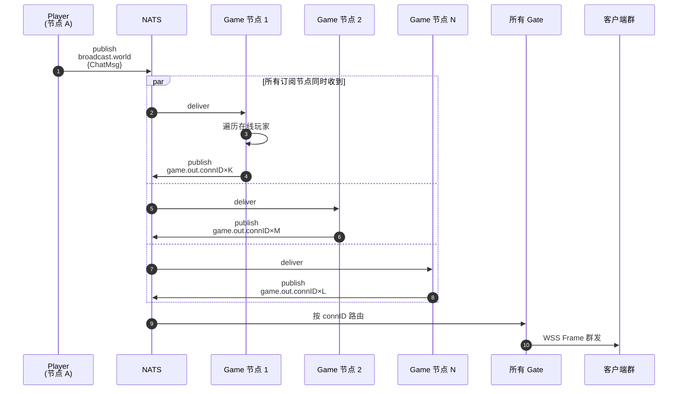
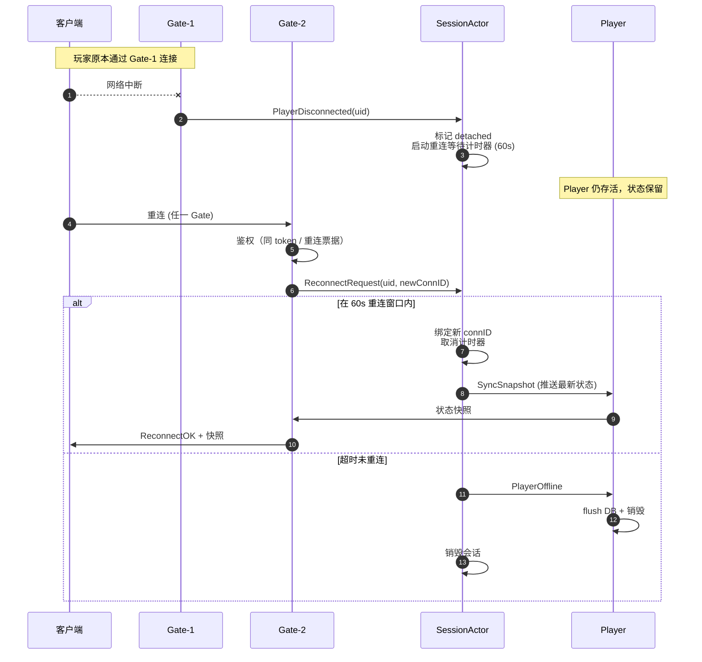
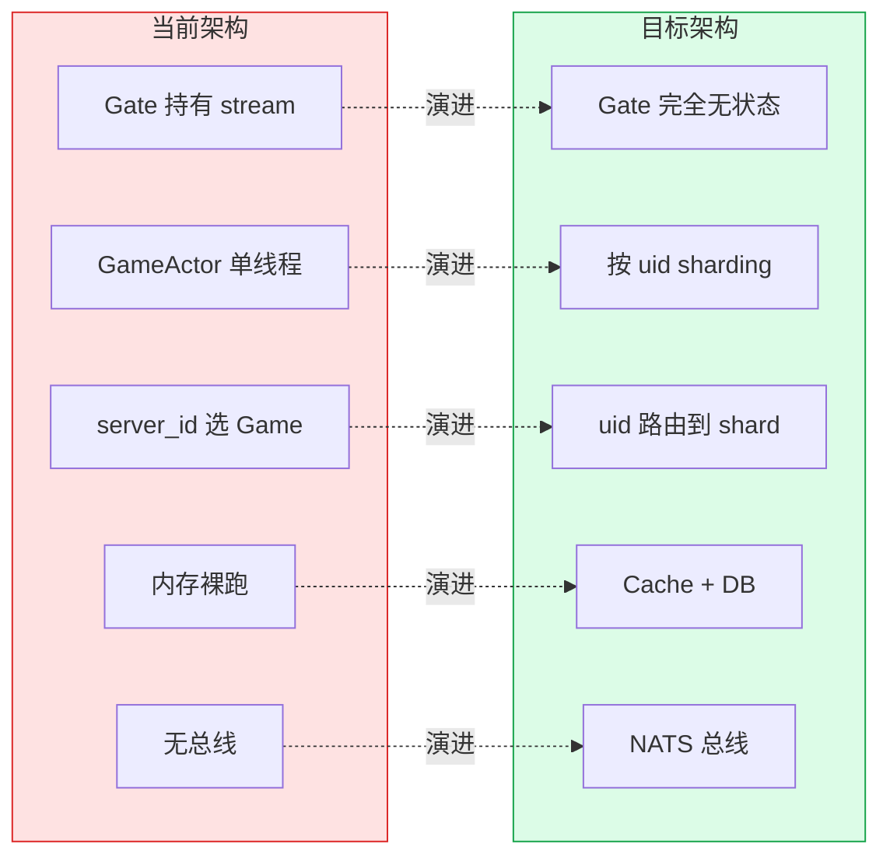

# 目标架构总览

> 配套 `ARCHITECTURE_REVIEW.md` 第三节的展开图。
> 描绘 P2 阶段完成后的目标形态。

---

## 一、整体架构图（分层视图）

```mermaid
flowchart TB
    %% ==================== 客户端层 ====================
    subgraph ClientLayer["📱 客户端层"]
        direction LR
        C1["游戏客户端 1"]
        C2["游戏客户端 2"]
        C3["游戏客户端 N"]
        BOT["压测 Bot"]
    end

    %% ==================== 接入层 ====================
    subgraph AccessLayer["🚪 接入层 (Gate · 完全无状态)"]
        direction LR
        LB{"Load Balancer<br/>(Nginx / SLB)"}
        subgraph Gates["Gate Pool"]
            GW1["Gate-1<br/>:8080<br/>━━━━━<br/>• WS 接入<br/>• 鉴权 / 限流<br/>• 心跳<br/>• 编解码"]
            GW2["Gate-2<br/>:8080"]
            GWN["Gate-N<br/>:8080"]
        end
    end

    %% ==================== 消息总线 ====================
    subgraph BusLayer["🔀 消息总线层 (NATS JetStream)"]
        direction TB
        T1[/"主题: game.in.&#123;shard&#125;<br/>客户端 → 玩家"/]
        T2[/"主题: game.out.&#123;connID&#125;<br/>玩家 → 客户端"/]
        T3[/"主题: broadcast.&#123;scope&#125;<br/>跨服广播"/]
        T4[/"主题: gm.cmd<br/>GM 指令"/]
    end

    %% ==================== 业务层 ====================
    subgraph GameLayer["🎮 业务层 (Game · 按 uid sharding)"]
        direction TB

        subgraph Node1["Game 节点 1 (shard 0~3)"]
            ROOT1["RootSupervisor"]
            subgraph Domains1["业务领域"]
                SES1["SessionSupervisor<br/>↓<br/>Session(uid)"]
                PLR1["PlayerSupervisor<br/>↓<br/>Player(uid)"]
                ROOM1["RoomSupervisor<br/>↓<br/>Room(roomID)"]
                SVC1["Services<br/>(Match / Chat / Daily)"]
            end
            ROOT1 --> Domains1
        end

        subgraph Node2["Game 节点 2 (shard 4~7)"]
            ROOT2["RootSupervisor"]
            Domains2["...同结构..."]
        end

        subgraph NodeN["Game 节点 N"]
            ROOTN["..."]
        end
    end

    %% ==================== 基础设施 ====================
    subgraph InfraLayer["🗄️ 基础设施层"]
        direction LR
        REDIS[("Redis Cluster<br/>━━━━━<br/>• 会话缓存<br/>• 玩家热数据<br/>• 分布式锁<br/>• 排行榜")]
        MONGO[("MongoDB<br/>━━━━━<br/>• 玩家持久化<br/>• 公会 / 物品<br/>• 战斗回放")]
        ETCD[("etcd<br/>━━━━━<br/>• 服务发现<br/>• 分布式配置<br/>• shard 分配")]
        OBS[("可观测性<br/>━━━━━<br/>• Prometheus<br/>• OpenTelemetry<br/>• Loki")]
    end

    %% ==================== 运维层 ====================
    subgraph OpsLayer["🛠️ 运维层"]
        direction LR
        GM["GM 后台<br/>(Web)"]
        GRAFANA["Grafana<br/>仪表盘"]
    end

    %% ==================== 连接关系 ====================
    C1 -.WSS.-> LB
    C2 -.WSS.-> LB
    C3 -.WSS.-> LB
    BOT -.WSS.-> LB

    LB --> GW1
    LB --> GW2
    LB --> GWN

    GW1 ==pub/sub==> BusLayer
    GW2 ==pub/sub==> BusLayer
    GWN ==pub/sub==> BusLayer

    BusLayer ==pub/sub==> Node1
    BusLayer ==pub/sub==> Node2
    BusLayer ==pub/sub==> NodeN

    Node1 -.读写.-> REDIS
    Node1 -.读写.-> MONGO
    Node2 -.读写.-> REDIS
    Node2 -.读写.-> MONGO

    Gates -.注册.-> ETCD
    GameLayer -.注册.-> ETCD

    Gates -.metric/log.-> OBS
    GameLayer -.metric/log.-> OBS

    GM ==> BusLayer
    OBS --> GRAFANA

    %% ==================== 样式 ====================
    style BusLayer fill:#fef3c7,stroke:#d97706,stroke-width:2px
    style REDIS fill:#fee2e2,stroke:#dc2626
    style MONGO fill:#dcfce7,stroke:#16a34a
    style ETCD fill:#dbeafe,stroke:#2563eb
    style OBS fill:#f3e8ff,stroke:#9333ea
    style ClientLayer fill:#f9fafb,stroke:#6b7280
    style AccessLayer fill:#ecfeff,stroke:#0891b2
    style GameLayer fill:#fef9c3,stroke:#ca8a04
```



---

## 二、典型流量路径

### 2.1 玩家请求 → 响应（最常见）



### 2.2 跨服广播（公会 / 世界喇叭）



### 2.3 断线重连



---

## 三、关键设计要点

### 3.1 分层职责矩阵

| 层 | 是否有状态 | 故障影响 | 扩容方式 |
|----|-----------|---------|----------|
| **Gate** | 无（仅 WS 连接） | 仅断开自身连接，客户端重连即恢复 | 无脑加机器 |
| **NATS** | 有（持久化队列） | 集群多副本容灾 | 添加节点 |
| **Game** | 有（actor 状态） | 单 shard 影响 1/N 玩家 | 加节点 + 重新分片 |
| **Redis** | 有（缓存） | 退化到 DB 直读，性能下降 | Cluster 扩容 |
| **MongoDB** | 有（数据） | 副本集容灾，主挂选举 | 副本集 / 分片 |

### 3.2 sharding 策略

```
shard_key = uid % shard_count
shard 分配 = etcd 中维护 {shard_id → game_node_id}
```

- **一致性哈希** vs **取模**：初期用取模（简单），后期换一致性哈希（rebalance 影响小）
- **shard 迁移**：通过 etcd 通知 → 源节点 freeze 并 dump → 目标节点 load → 流量切换
- **shard 数 >> 节点数**：比如 1024 shard / 8 节点，便于渐进式扩缩容

### 3.3 NATS 主题设计

| 主题模式 | 例子 | 用途 | 持久化 |
|----------|------|------|--------|
| `game.in.{shard}` | `game.in.42` | 玩家请求路由 | JetStream（保证投递） |
| `game.out.{connID}` | `game.out.99887` | 服务端推送 | Core NATS（fire-and-forget 即可） |
| `broadcast.{scope}` | `broadcast.world` / `broadcast.guild.{gid}` | 广播 | Core NATS |
| `gm.cmd` | `gm.cmd` | GM 指令 | JetStream |
| `system.event` | `system.event.shard_migrate` | 系统事件 | JetStream |

### 3.4 关键不变量

无论怎么演进，这几条要守住：

1. **每个在线玩家有且仅有一个 Player**（uid 是全局唯一身份）
2. **Gate 不持有任何业务状态**（重启 / 扩缩容不丢业务数据）
3. **Player 的状态修改必须同时入 cache 和 DB**（DB 是真实之源，cache 是性能优化）
4. **跨 actor 通信只走消息**（不通过共享内存或全局变量）
5. **所有外部 IO 必须有超时和重试**（DB / Redis / NATS）

---

## 四、与当前架构的核心差异



| 维度 | 当前 | 目标 |
|------|------|------|
| **Gate** | 持有 gRPC stream，状态相关 | 无状态，纯协议适配器 |
| **进程间通信** | gRPC 双向流（点对点） | NATS 总线（解耦） |
| **并发粒度** | 整服 1 个 actor | 每玩家 1 个 actor |
| **扩展方式** | 加区服 | 加节点 + rebalance |
| **故障半径** | 整个区服 | 单 shard / 单 actor |
| **数据持久化** | 无 | Cache + DB 双层 |
| **跨服能力** | 无 | NATS 原生支持 |
| **可观测** | 日志 | metric + trace + log |

---

## 相关文档

- [`ARCHITECTURE.md`](./ARCHITECTURE.md) — 当前架构
- [`ARCHITECTURE_REVIEW.md`](./ARCHITECTURE_REVIEW.md) — 架构评审与规划主文档
- [`OPTIMIZATION.md`](./OPTIMIZATION.md) — 代码层面的具体问题
